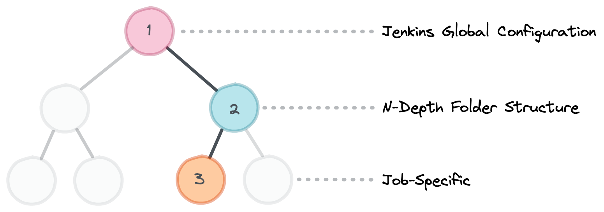

# Pipeline Initialization

Pipeline Initialization is the term JTE uses to describe everything that happens from when a Pipeline Run is started to when the Pipeline starts.

## Overview

This stages of Pipeline Initialization are described in the table and picture below.

{ class=center width=50% }

| Stage              | Description                                                                                                                                                                           |
|------------------------------------|---------------------------------------------------------------------------------------------------------------------------------------------------------------------------------------|
| Pipeline Configuration Aggregation | [Pipeline Configurations][config] fetched from [Governance Tiers][gov-tier] in the [Configuration Hierarchy][hierarchy] and merged, creating an **aggregated pipeline configuration** |
| Pipeline Primitives Injected       | JTE parses the aggregated pipeline configuration and creates the corresponding [Pipeline Primitives][primitives]                                                                      |
| Pipeline Template Determined       | JTE determines the [Pipeline Template][template] to use according to the process outlined in [Pipeline Template Selection][template-selection]                                        |
| Pipeline Template Compiled         | The groovy Pipeline Template is compiled into the final form that will be executed the same way as any other Jenkinsfile                                                              |

## Pipeline Configuration Aggregation

During the Pipeline Configuration Aggregation phase, JTE fetches the [Pipeline Configuration][config] from each [Governance Tier][gov-tier] (if present) in the [Configuration Hierarchy][hierarchy].

{ class=center }

These Pipeline Configurations are then sequentially merged, according to the procedure outlined in [Merging Pipeline Configurations](../pipeline-configuration/merging-configs.md).

{ class=center width=50% }

The result of this process is an aggregated Pipeline Configuration for the Pipeline Run.
The [Map][map] representation of the aggregated Pipeline Configuration is made available via the [`pipelineConfig` Autowired Variable][pipelineConfig].

## Pipeline Primitives Injected

This next phase of Pipeline Initialization takes the aggregated Pipeline Configuration and parses it to create [Pipeline Primitives][primitives].

This happens by passing the aggregated Pipeline Configuration to a series of Template Primitive Injectors.
Each Pipeline Primitive has a corresponding Template Primitive Injector that reads the aggregated Pipeline Configuration and creates the corresponding Pipeline Primitives.

{ class=center }

The Pipeline Primitives created during this phase are stored on the [Pipeline Primitive Namespace][primitive-namespace].

!!! important
    You may remember from reading the [Pipeline Configuration Syntax][config-syntax] that JTE's Pipeline Configuration DSL is just a dynamic builder language, meaning that it will accept any configurations it is given.
    The only reason `application_environments` *does anything* is because there is a Template Primitive Injector that specifically looks for that block.

## Pipeline Template Determined

Next, JTE determines the [Pipeline Template][template] based on the process outlined in [Pipeline Template Selection][template-selection].

## Pipeline Template Compiled

Finally, the determined Pipeline Template is compiled.

JTE performs some [Compile-Time Metaprogramming][compile-time-mp] to wrap the Pipeline Template in a Try-Catch-Finally block so that the [Lifecycle Hooks][hooks] can be executed before and after Pipeline Template Execution.

This compiled Pipeline is then executed **just like any other Jenkinsfile**.

!!! example "Pipeline Template Compilation"
    JTE performs compile-time metaprogramming to slightly manipulate the Pipeline Template.
    What follows is an example to understand the transformation that takes place.

    === "Provided Pipeline Template"
        ```groovy
        build()
        ```
    === "Compiled Pipeline Template"
        ```groovy
        try{
          // code that invokes @Validation annotated methods in steps
          // code that invokes @Init annotated methods in steps 
          build() // <-- original Pipeline Template
        } finally {
          // code that invokes @CleanUp annotated methods in steps
          // code that invokes @Notify annotated methods in steps
        }
        ```

[config]: ../pipeline-configuration/overview.md
[gov-tier]: ../pipeline-governance/governance-tier.md
[hierarchy]: ../pipeline-governance/configuration-hierarchy.md
[primitives]: ../pipeline-primitives/overview.md
[template]: ../pipeline-templates/overview.md
[template-selection]: ../pipeline-governance/pipeline-template-selection.md
[map]: https://docs.groovy-lang.org/latest/html/groovy-jdk/java/util/Map.html
[pipelineConfig]: ../../../reference/autowired-variables/#pipelineconfig
[config-syntax]: ../pipeline-configuration/configuration-dsl.md
[primitive-namespace]: ../pipeline-primitives/primitive-namespace.md
[compile-time-mp]: http://groovy-lang.org/metaprogramming.html#_compile_time_metaprogramming
[hooks]: ../library-development/lifecycle-hooks.md
