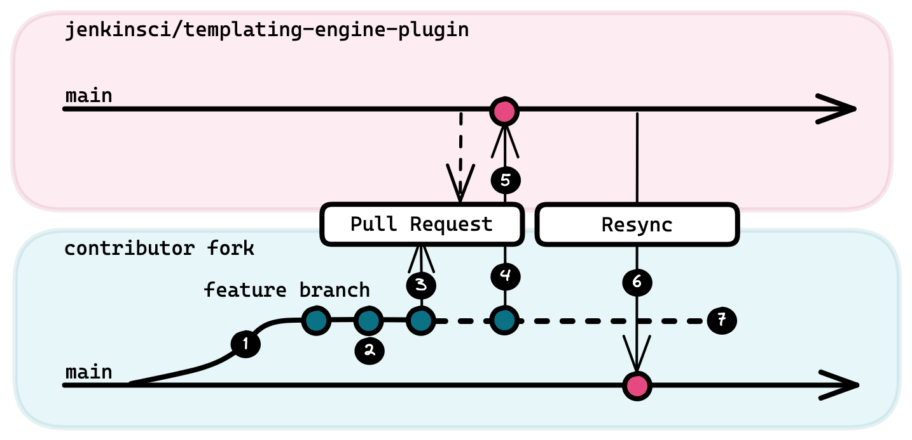

---
  hide:
  - toc
---
# Fork-Based Contribution Model

JTE follows a fork-based contribution model, also called a [Fork and Pull Model][1].

Contributors work in their own [Forks][2] on Feature Branches and send changes through [Pull Requests][3] to the [main branch of the upstream JTE repository][4].

## Add the Upstream Remote

After forking the upstream repository, it's helpful to add the upstream repository as a remote.

This can be done by running the command:

```bash
git remote add upstream https://github.com/jenkinsci/templating-engine-plugin.git
```

## Contribution Workflow

After creating your fork and adding the upstream remote, use the following workflow to submit changes to JTE:

{ class=center width=75%}

|   |            Step             | Description                                                           | Git Commands                                                                    |
|---|:---------------------------:|-----------------------------------------------------------------------|-------------------------------------------------------------------------------------------------|
| 1 |   Create a Feature Branch   | Create a branch specifically for your change                          | `git checkout -B <branch_name>`<br>`git push --set-upstream origin <branch_name>`               |
| 2 |        Push Changes         | Push incremental changes to your feature branch                       | `git add <files>`<br>`git commit -m <message>`<br>`git push origin <branch_name>`               |
| 3 |    Submit a Pull Request    | Open a Pull Request to the `main` branch of the JTE repository        | Done via the GitHub web interface                                                               |
| 4 |    Incorporate Feedback     | The JTE maintainers may provide some feedback.                        | `git add <files>`<br>`git commit -m <message>`<br>`git push origin <branch_name>`               |
| 5 |            Merge            | Once accepted, JTE maintainers will merge the PR                      | no action on contributor's part                                                                 |
| 6 | Resynchronize with upstream | The merge will squash the commits, so realign your fork with upstream | `git checkout main`<br>`git fetch --all`<br>`git merge upstream/main`<br>`git push origin main` |
| 7 | Delete your Feature Branch  | Your feature branch can now be removed                                | `git branch -d <branch_name>`<br>`git push origin --delete <branch_name>`                       |

[1]: https://docs.github.com/en/github/collaborating-with-pull-requests/getting-started/about-collaborative-development-models#fork-and-pull-model
[2]: https://docs.github.com/en/github/collaborating-with-pull-requests/working-with-forks/about-forks
[3]: https://docs.github.com/en/github/collaborating-with-pull-requests/proposing-changes-to-your-work-with-pull-requests/about-pull-requests
[4]: https://github.com/jenkinsci/templating-engine-plugin
