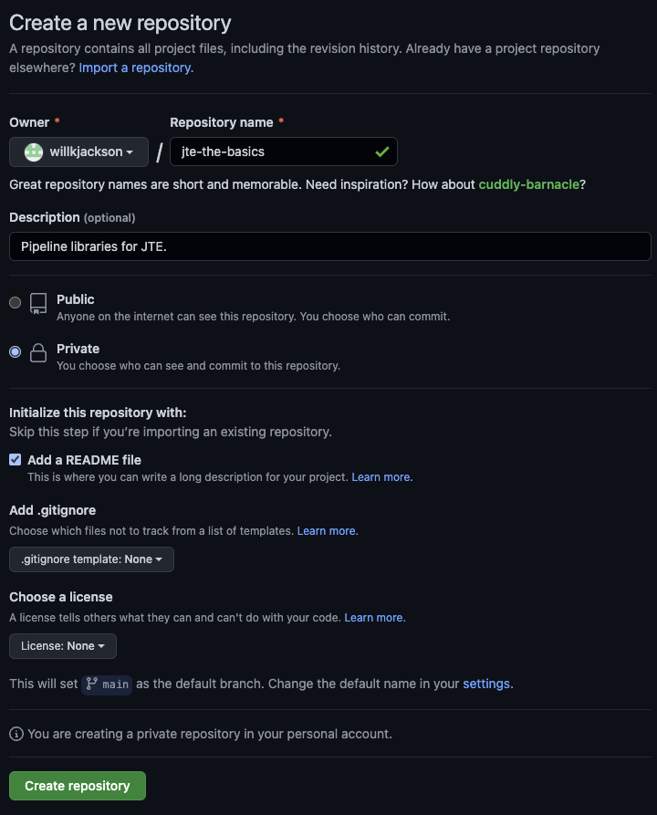

# Create the Libraries

In the previous section we created a Pipeline Template that invoked `build()` and `static_code_analysis()` steps.

In this part of the lab, we're going to create libraries for these steps to implement them in our template.

## Create a GitHub Repository

Libraries can either be packaged into a separate plugin for distribution or fetched directly from a source code management repository.

Retrieving libraries from a repository is the most common way of storing pipeline libraries for integration with the Jenkins Templating Engine (JTE).

Go ahead and create a new GitHub repository in your account:

* Click your profile picture in GitHub, and go to `Your repositories`.
* Click the `New` button at top right and use the following configuration:



It can be named whatever you like, though `jte-the-basics` would make sense.

## Create the Libraries

Clone your new repository, then create and push the following directory structure, with empty files:

``` text
.
└── libraries
    ├── maven
    │   └── steps
    │       └── build.groovy
    └── sonarqube
        └── steps
            └── static_code_analysis.groovy
```

!!! important
    If you need a primer on Git (i.e. how to commit and push code changes) try reading over the `Making changes` section [here](https://git-scm.com/docs/gittutorial#_making_changes).

    When configuring this repository as a *Library Source* for JTE in Jenkins, you will be able to configure the base directory. Since there might be other sources in this repository in the future, all of the libraries we create will be stored in the `libraries` directory.

It is important to understand that a library in JTE is just a _directory_, likely in a source code repository, that contains a steps directory with Groovy script files. When a library is loaded, each Groovy file in the library's steps directory will become a step named after the base filename.

Push the code to the `main` branch. Your repo in the GitHub web UI should look like this:


## Implement the Steps

In this lab, we're just getting accustomed to the Jenkins Templating Engine and how it works. So the implementation of the steps for this lab will just be print statements that show where the step is coming from.

Generally, the most idiomatic way to define a step is to create a `call` method that takes no input parameters.

!!! note
    In future labs, we'll learn how to pass information to our steps through the pipeline configuration file.

Push the following code to the empty files you created in your library repo:

``` groovy title="./libraries/maven/steps/build.groovy"
void call() {
    stage("Maven: Build") {
        println "build from the maven library"
    }
}
```

``` groovy title="./libraries/sonarqube/steps/static_code_analysis.groovy"
void call() {
    stage("SonarQube: Static Code Analysis") {
        println "static code analysis from the sonarqube library"
    }
}
```

## Configure the Library Source

Now that we have a GitHub repository containing pipeline libraries, we have to tell JTE where to find them.

This is done by configuring a *Library Source* in Jenkins.

To make our libraries accessible to every job configured to use JTE on the Jenkins instance:

* In the left-hand navigation menu, click `Manage Jenkins`.
* User `System Configuration`, click `Configure System`.
* Scroll down to the `Jenkins Templating Engine` configuration section.
* Click `Add` under `Library Sources` -- do not edit the `Pipeline Configuration` section.
* Ensure the `Library Provider` is set to `From SCM`.
* Select `Git` as the `SCM` type.
* Enter the *https* repository URL to your library repository you pushed the Groovy scripts to. It should end in `.git`.
* Under `Branch Specifier`, specify whatever branch you have been pushing changes to, be it `*/main`, `*/master`, or something else.
* In the `Credentials` drop down menu, select the `github` credential created during the prerequisites.
* Enter `libraries` in the `Base Directory` text box.
* Click `Save`.


!!! note
    As an aside - you can define as many Library Sources as you need. They can be defined globally for the entire Jenkins instance in `Manage Jenkins > Configure System >  Jenkins Templating Engine` or under the `Jenkins Templating Engine` configuration section on Folders, or per-job, for more complex inheritance of libraries.
